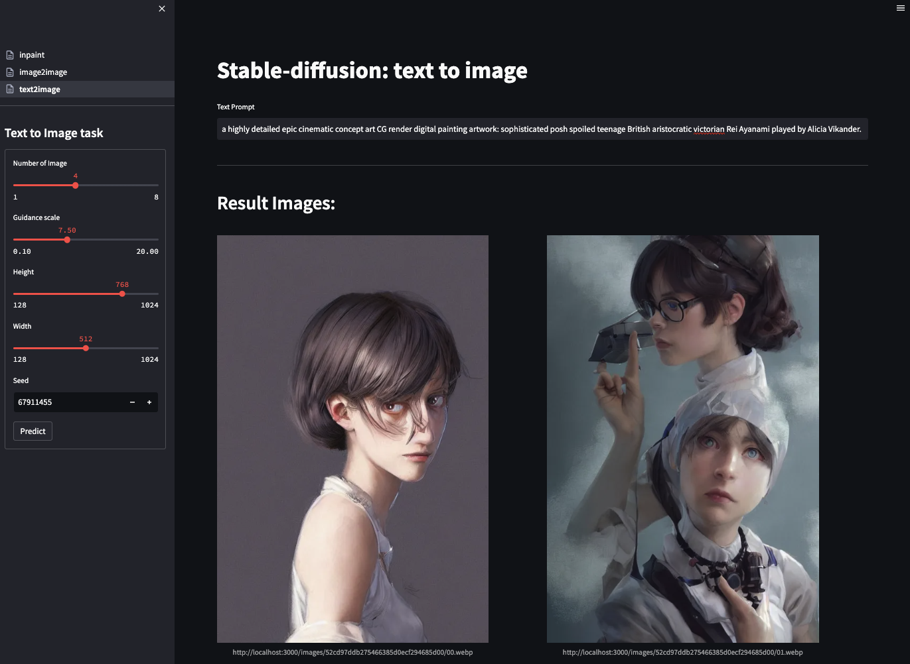
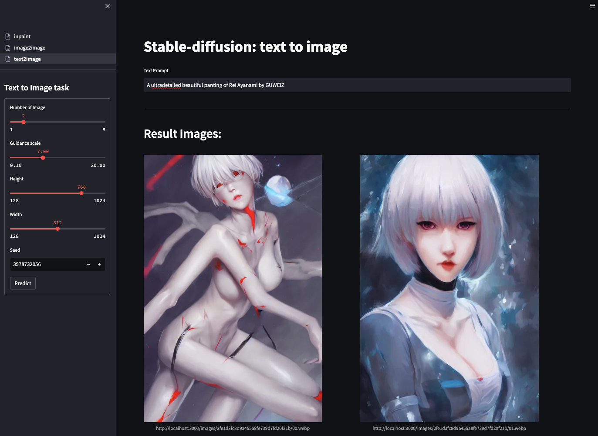
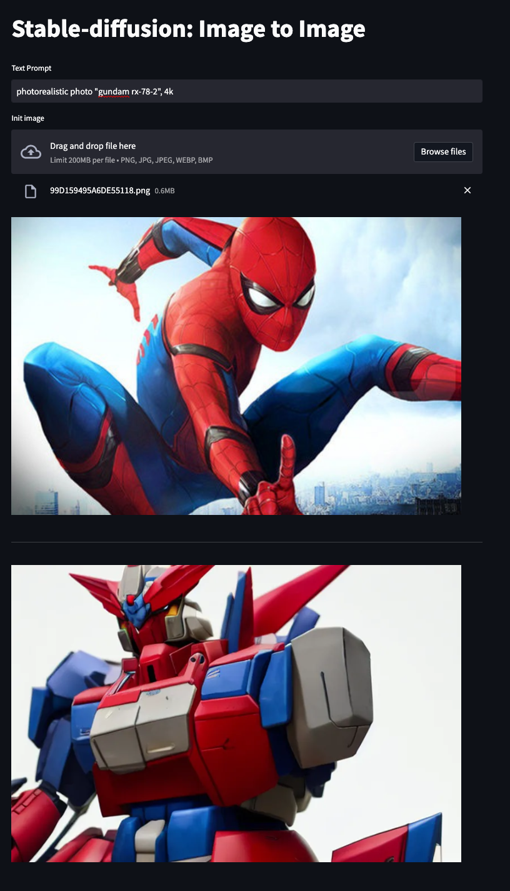

# Unofficial Fastapi implementation Stable-Diffusion API

UNOFFICIAL, [Stable-Diffusion](https://github.com/CompVis/stable-diffusion) api using FastAPI

# Samples

|           Text2Image-01            |           Text2Image-02            |
| :--------------------------------: | :--------------------------------: |
|   |   |
|           Image2Image-01           |           Image2Image-02           |
|  |  |
|             Inpaint-01             |             Inpaint-02             |
|      |      |
|      |      |

# Requirements

## API

```txt
fastapi[all]==0.80.0
fastapi-restful==0.4.3
fastapi-health==0.4.0
service-streamer==0.1.2
pydantic==1.9.2
diffusers==0.3.0
transformers==4.19.2
scipy
ftfy
```

## Frontend
```txt
streamlit==1.12.2
requests==2.27.1 
requests-toolbelt==0.9.1 
pydantic==1.8.2
streamlit-drawable-canvas==0.9.2
```


# API

## /text2image
create image from input prompt

inputs:

    - prompt(str): text prompt
    - num_images(int): number of images
    - guidance_scale(float): guidance scale for stable-diffusion
    - height(int): image height
    - width(int): image width
    - seed(int): generator seed

outputs:

    - prompt(str): input text prompt
    - task_id(str): uuid4 hex string
    - image_urls(str): generated images url


## /image2image
create image from input image

inputs:

    - prompt(str): text prompt
    - init_image(imagefile): init image for i2i task
    - num_images(int): number of images
    - guidance_scale(float): guidance scale for stable-diffusion
    - seed(int): generator seed

outputs:

    - prompt(str): input text prompt
    - task_id(str): uuid4 hex string
    - image_urls(str): generated images url


# Environment variable


```bash
# env setting is in 
>> ./core/settings/settings.py
```

| Name               | Default                       | Desc                                              |
| ------------------ | ----------------------------- | ------------------------------------------------- |
| MODEL_ID           | CompVis/stable-diffusion-v1-4 | tagger embedding model part                       |
| CUDA_DEVICE        | "cpu"                         | target cuda device                                |
| CUDA_DEVICES       | [0]                           | visible cuda device                               |
| MB_BATCH_SIZE      | 1                             | Micro Batch: MAX Batch size                       |
| MB_TIMEOUT         | 120                           | Micro Batch: timeout sec                          |
| HUGGINGFACE_TOKEN  | None                          | huggingface access token                          |
| IMAGESERVER_URL    | None                          | result image base url                             |
| SAVE_DIR           | static                        | result image save dir                             |
| CORS_ALLOW_ORIGINS | [*]                           | cross origin resource sharing setting for FastAPI |

# RUN from code (API)

## 1. install python Requirements
```bash
pip install -r requirements.txt
```

## 2. downlaod and caching huggingface model
```bash
python huggingface_model_download.py
# check stable-diffusion model in huggingface cache dir 
[[ -d ~/.cache/huggingface/diffusers/models--CompVis--stable-diffusion-v1-4 ]] && echo "exist"
>> exist
```

## 3. update settings.py in ./core/settings/settings.py
```python
# example
...
class Settings(
    ...
):
    HUGGINGFACE_TOKEN: str = "YOUR HUGGINGFACE ACCESS TOKEN"
    IMAGESERVER_URL: str  = "http://localhost:3000/images"
    SAVE_DIR: str = 'static'
    ...
```

## 4. RUN API by uvicorn
```bash
cd /REPO/ROOT/DIR/PATH
python3 -m uvicorn app.server:app \
    --host 0.0.0.0 \
    --port 3000 \
    --workers 1 
```

# RUN from code (frontend)

## 1. install python Requirements
```bash
pip install \
    streamlit==1.12.2 \
    requests==2.27.1 \
    requests-toolbelt==0.9.1 \
    pydantic==1.8.2 \
    streamlit-drawable-canvas==0.9.2
```

## 2. RUN streamlit frontend
```bash
streamlit run inpaint.py
```


# RUN using Docker (docker-compose)

## 1. Image Build 
```bash
docker-compose build
```

## 2. downlaod and caching huggingface model
```bash
python huggingface_model_download.py
# check stable-diffusion model in huggingface cache dir 
[[ -d ~/.cache/huggingface/diffusers/models--CompVis--stable-diffusion-v1-4 ]] && echo "exist"
>> exist
```

## 3. update docker-compose.yaml file in repo root
```yaml
version: "3.7"

services:
  api:
    ...
    volumes:
      # mount huggingface model cache dir path to container root user home dir
      - /home/{USER NAME}/.cache/huggingface:/root/.cache/huggingface
      - ...
    environment:
      ...
      HUGGINGFACE_TOKEN: {YOUR HUGGINGFACE ACCESS TOKEN}
      ...

    deploy:
      ...
  frontend:
    ...
```

## 4. Container RUN
```bash
docker-compose up -d 
# or API only
docker-compsoe up -d  api
# or frontend only
docker-compsoe up -d  frontend
```


## References
- [CompVis/stable-diffusion](https://github.com/CompVis/stable-diffusion)
- [huggingface, stable-diffusion](https://huggingface.co/CompVis)
- [teamhide/fastapi-boilerplate](https://github.com/teamhide/fastapi-boilerplate)